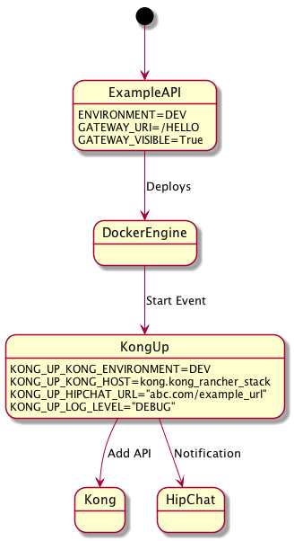

<h2>Table of Contents</h2>

<ul>
<li><a href="#sec-1">1. KongUp</a>
<ul>
<li><a href="#sec-1-1">1.1. Introduction</a></li>
<li><a href="#sec-1-2">1.2. How Does it work?</a></li>
<li><a href="#sec-1-3">1.3. Labels</a></li>
<li><a href="#sec-1-4">1.4. Environment Variables</a></li>
<li><a href="#sec-1-5">1.5. Running in Docker</a></li>
<li><a href="#sec-1-6">1.6. Running in Rancher</a></li>
<li><a href="#sec-1-7">1.7. Quick troubleshooting</a></li>
<li><a href="#sec-1-8">1.8. How to contribute</a></li>
<li><a href="#sec-1-9">1.9. Supported Versions</a></li>
<li><a href="#sec-1-10">1.10. License</a></li>
</ul>
</li>
</ul>

# KongUp

## Introduction

KongUp is a dockerized service that runs on each host machine in a
Rancher/Cattle environment and automatically adds APIs to Kong as
services are deployed. KongUp listens to the docker events and
inspects a container's labels to add it to Kong.

## How Does it work?

KongUp binds to the docker socket on each host VM and listens for
"start" events. It them inspects the container that just started and
examines its labels. If GATEWAY\\VISIBLE is True, and GATEWAY\\URI is
provided, and if the container's environment matches with KongUp's
environment, KongUp will add it as an API to the Kong gateway
specified via environment variables. KongUp runs a port scan on the
API container to automatically find the port where the application is
running on.  Furthermore, KongUp sends notifications via HipChat.

## Labels

The following labels must be set on services (containers) that you
want KongUp to process and add to Kong.

<table border="2" cellspacing="0" cellpadding="6" rules="groups" frame="hsides">

<colgroup>
<col  class="left" />

<col  class="left" />

<col  class="left" />
</colgroup>
<tbody>
<tr>
<td class="left">Label</td>
<td class="left">Description</td>
<td class="left">Required</td>
</tr>

<tr>
<td class="left">GATEWAY\\VISIBLE</td>
<td class="left">Either True or False, Will Only add to API if set to True.</td>
<td class="left">Yes</td>
</tr>

<tr>
<td class="left">GATEWA\YURI</td>
<td class="left">Kong uri (kong version >= 0.10.0) property</td>
<td class="left">Yes</td>
</tr>

<tr>
<td class="left">ENVIRONMENT</td>
<td class="left">The environment of the gateway to which the API should be added</td>
<td class="left">Yes</td>
</tr>

<tr>
<td class="left">STRIP\\URI</td>
<td class="left">When matching an API via one of the uris prefixes, strip that matching prefix from the upstream URI to be requested. Optional. Defaults to 'True'. Value must be one of 'True', 'False', or ''. Your services must have some docker labels on them in order for KongUp to detect it.</td>
<td class="left">Yes</td>
</tr>
</tbody>
</table>

## Environment Variables

<table border="2" cellspacing="0" cellpadding="6" rules="groups" frame="hsides">

<colgroup>
<col  class="left" />

<col  class="left" />

<col  class="left" />
</colgroup>
<tbody>
<tr>
<td class="left">Variable</td>
<td class="left">Description</td>
<td class="left">Required</td>
</tr>

<tr>
<td class="left">KONG\\UP\\KONGENVIRONMENT</td>
<td class="left">Which environment is this kong for?</td>
<td class="left">Yes</td>
</tr>

<tr>
<td class="left">KONG\\UP\\KONGHOST</td>
<td class="left">Hostname of machine where Kong is installed</td>
<td class="left">Yes</td>
</tr>

<tr>
<td class="left">KONG\\UP\\HIPCHATURL</td>
<td class="left">Hipchat link to post notifications to</td>
<td class="left">Yes</td>
</tr>

<tr>
<td class="left">KONG\\UP\\LOGLEVEL</td>
<td class="left">Level of logging. Must be one of DEBUG, INFO, WARN, ERROR, FATAL</td>
<td class="left">Yes</td>
</tr>
</tbody>
</table>

## Running in Docker

\`\`\` docker run -d \\ -v /run/docker.sock:/var/run/docker.sock \\ -e
KONGUPKONGENVIRONMENT="DEV" \\ -e
KONGUPKONGHOST="dev.api.deluxe.com" \\ -e
KONGUPHIPCHATURL="xxx.com"\\ -e KONGUPLOGLEVEL="DEBUG"\\
kongupimagename \`\`\`

## Running in Rancher

You can run the KongUp container on rancher with the same configs as
running it locally. But be sure you select the "Always run one
instance of this container on every host" option.

## Quick troubleshooting

Check the logs to see if there are any exceptions. There are no
external dependencies, so everything should work as expected.

## How to contribute

If you notice a bug or would like to add improvements, please send a
pull request with your fix.

## Supported Versions

KongUp was tested on the following environment

-   Rancher == 1.6.2
-   Kong == 0.11.0
-   Docker == 1.12.6
-   HipChat == V2 API

## License

Copyright 2017 Deluxe Corporation

Licensed under the Apache License, Version 2.0 (the "License"); you
may not use this file except in compliance with the License.  You may
obtain a copy of the License at

<http://www.apache.org/licenses/LICENSE-2.0>

Unless required by applicable law or agreed to in writing, software
distributed under the License is distributed on an "AS IS" BASIS,
WITHOUT WARRANTIES OR CONDITIONS OF ANY KIND, either express or
implied.  See the License for the specific language governing
permissions and limitations under the License.
